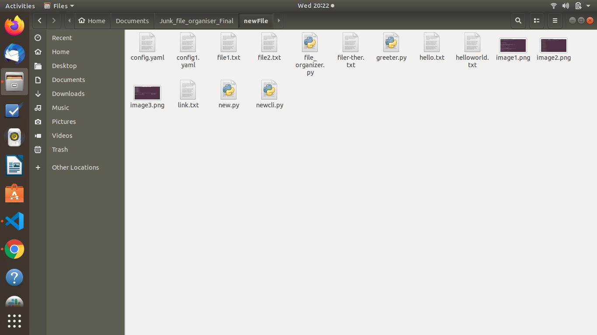
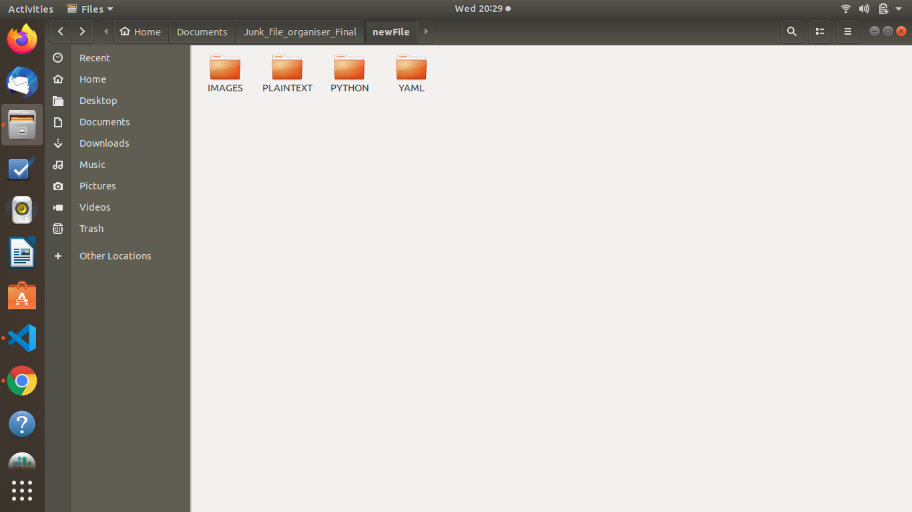
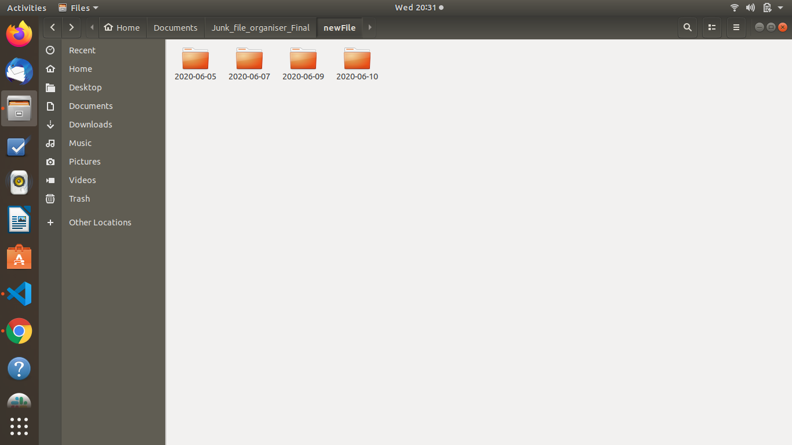
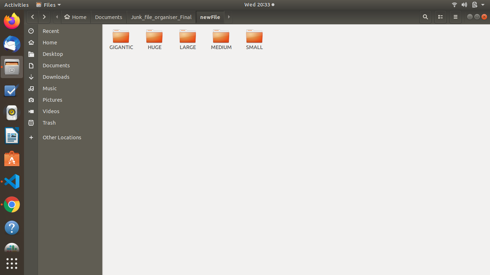

# Junk File Organiser
Arranging files on your computer is very tedious process . Say you want to organize your clothes. You might arrange each type of clothes into separate stacks or you could throw everything into one place and hope you can find the right pair of clothes when you need it. And that's how we typically treat our files: we save files randomly to our Desktop and Documents folders, then waste time searching for files every day.
This is very useful for Lazy programmer who keeps bunch of files and folders at one location and sometimes he is in lot of confusion about
which files are present. It is very boring task to manually arrange all the files into one folder.So This a python programm to organise everything in the single go in a blink of an eye.

### prerequisites
- python 3.7 (Install this from the  official website https://www.python.org/)
- Basic knowledge of how to use command prompt and command line argument
### How to run
- run the junk_file_organizer.py script using command line to the desired location where we want to 
    organise the folders or give the path of your desire directory.

### Commands
    1) python3 junk_file_organizer.py organize [Path] -- keyword Date

    2) python3 junk_file_organizer.py organize [Path] -- keyword Size

    3) python3 junk_file_organizer.py organize_by_ext [Path]

    4) python3 file_organizer.py organize [default Path] --[ default Keyword]

    5) python3 junk_file_organizer.py organize_by_ext [default Path]

### Screenshots:
- Before running the script:

- After running the script according to the extention:

- After running the script according to the Last modified date:

- After running the script according to the file size:

### Requirements:
- usage of os module
- usage of shutil module
- usage of fnmatch module
- usage of click module
- File handling in python
- recursion

### Approach:
1. Create different folders based on type of files according to size/modified date/extention we are 
going to segregate into different folders using dictionaries.
2. Create the map of file types into their respective folders.
3. Create a function to filter file types into their respective folders
4. Use os module of python to recursively list out all the files that are present in the folders with their relative and absolute path 
5. Using Shutil module of python, move all the folders into a newly created folders depending on keywords and extantion.
6. After running the above setup in the required destination, the output will be something iike as shown in the above image.
 
### Extra Features:
1. This script can organize the files according to given specific extention in the command line
    eg :-> python3 junk_file_organizer organize [ Path ] --keyword [File Name]
2. This script can organize the files of according to the substring of the file name.
    eg :-> python3 junk_file_organizer.py organize_by_ext [ Path ] --extention[Extension Name]
    
### Built using:
1. Python language
2. The code is built according to the standard pep8/flake8 rules and regulations.
